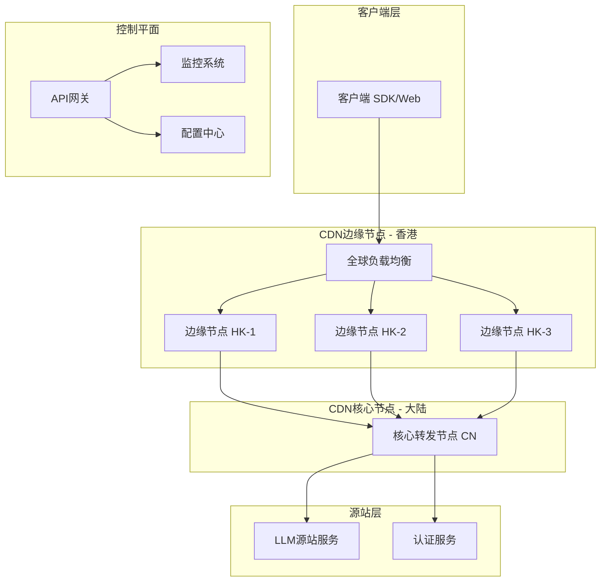
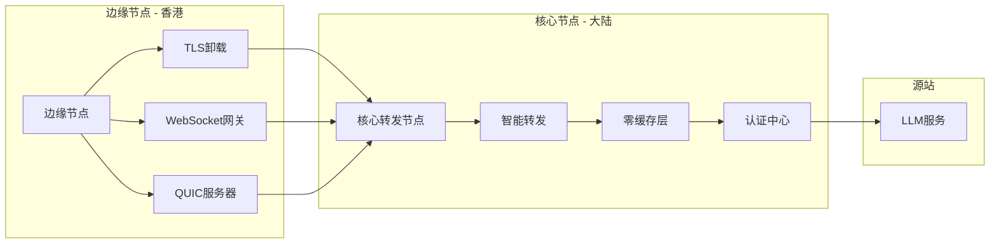
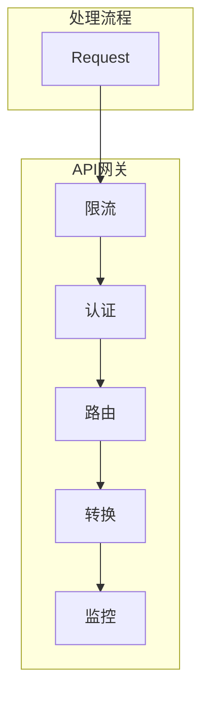
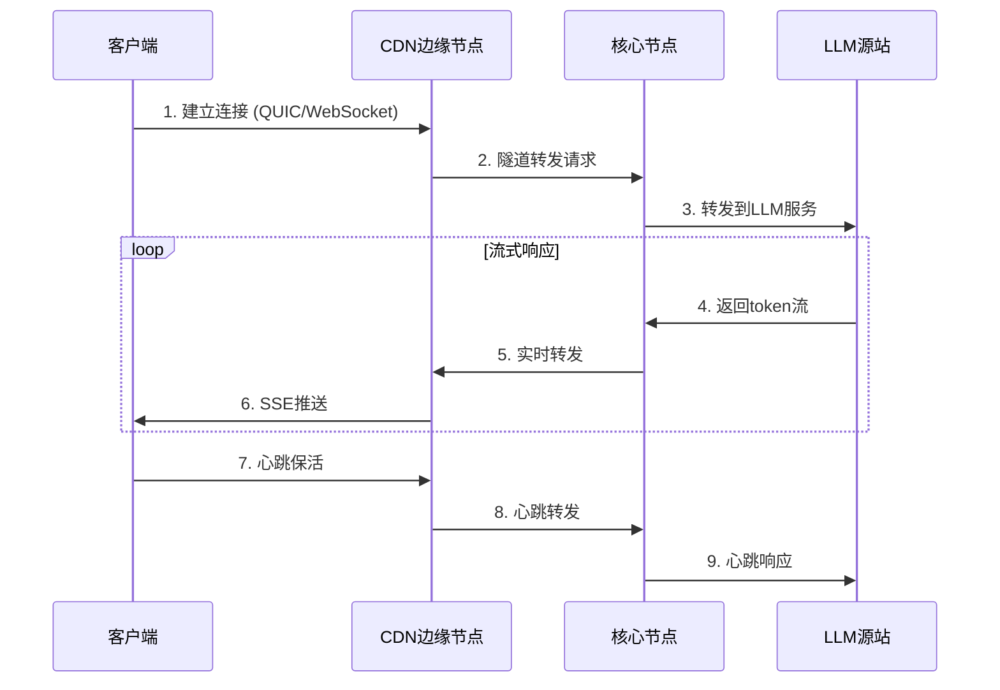

# AI大模型对话系统 - 高并发CDN隧道转发架构设计

## 1. 项目概述

### 1.1 业务需求
- **场景**：AI大模型对话系统（LLM Chat）
- **特点**：动态内容、SSE长对话流式响应、极低延迟要求
- **架构**：客户端 → CDN节点 → 源站（单源站LLM服务）
- **覆盖**：香港-大陆跨境节点

### 1.2 性能目标
- **高并发连接**：支持数十万级并发SSE连接
- **低延迟**：端到端延迟 < 100ms
- **零缓存**：所有请求实时转发到源站
- **高可用**：多节点容灾、故障自动切换

---

## 2. 系统架构总览



---

## 3. 核心设计模块

### 3.1 隧道转发层设计

#### 3.1.1 多协议支持
基于gost现有能力，增强以下协议支持：

```go
// 核心隧道配置
type TunnelConfig struct {
    // 监听配置
    Listeners []ListenerConfig
    
    // 转发配置
    Dialers []DialerConfig
    
    // 协议优化
    Protocol ProtocolConfig
}

type ProtocolConfig struct {
    // QUIC配置（低延迟、高并发）
    QUIC *QUICConfig
    
    // WebSocket配置（浏览器兼容）
    WebSocket *WebSocketConfig
    
    // TLS配置（安全传输）
    TLS *TLSConfig
    
    // TCP配置（基础可靠传输）
    TCP *TCPConfig
}
```

#### 3.1.2 QUIC优化（核心协议）
- **0-RTT连接**：减少握手延迟
- **多路复用**：单连接支持并发请求
- **拥塞控制**：BBR算法优化
- **连接迁移**：网络切换不断线

```go
// QUIC性能优化配置
type QUICConfig struct {
    MaxIdleTimeout      time.Duration
    MaxIncomingStreams  int32           // 1000+ 并发流
    MaxReceiveStreams   int32           // 1000+ 并发流
    KeepAlivePeriod     time.Duration
    CongestionControl   string          // "bbr" | "cubic"
    DisablePathMTUDiscovery bool
}
```

#### 3.1.3 WebSocket/SSE优化
- **连接池管理**：复用WebSocket连接
- **流控优化**：背压控制
- **分块传输**：大响应分块发送

```go
// SSE流式响应配置
type SSEConfig struct {
    BufferSize          int             // 64KB缓冲
    ChunkSize           int             // 4KB分块
    HeartbeatInterval   time.Duration   // 30s心跳
    MaxConnectionAge    time.Duration   // 24h最大连接时间
    Compression         bool            // 是否压缩
}
```

---

### 3.2 CDN节点架构设计

#### 3.2.1 节点类型



#### 3.2.2 边缘节点（香港）
```yaml
# 边缘节点配置 - gost.yml
services:
  # QUIC监听 - 主要协议
  - name: quic-edge
    addr: ":443"
    handler:
      type: http3
      dialer:
        type: http3
        host: ${CORE_NODE_IP}
        port: 8443
    listener:
      type: quic
      config:
        max-idle-timeout: 300s
        max-incoming-streams: 10000
        alpn: ["h3", "h3-32", "h3-31"]
    
  # WebSocket兼容
  - name: ws-edge
    addr: ":8080"
    handler:
      type: http
      dialer:
        type: http
        host: ${CORE_NODE_IP}
        port: 8080
    listener:
      type: ws
      config:
        read-buffer-size: 65536
        write-buffer-size: 65536

  # TLS配置
  tls:
    cert-file: /etc/gost/certs/server.crt
    key-file: /etc/gost/certs/server.key
```

#### 3.2.3 核心节点（大陆）
```yaml
# 核心节点配置
services:
  # 转发服务
  - name: relay-core
    addr: ":8443"
    handler:
      type: relay
      dialer:
        type: tcp
        host: ${LLM_SOURCE_IP}
        port: 8000
    listener:
      type: quic
      config:
        max-incoming-streams: 10000

  # 认证服务
  - name: auth-service
    addr: ":18080"
    handler:
      type: api
    listener:
      type: tcp
```

---

### 3.3 零缓存策略设计

#### 3.3.1 核心原则
- **不缓存**：所有请求直接转发到源站
- **实时性**：毫秒级响应
- **一致性**：始终获取最新数据

```go
// 零缓存配置
type ZeroCacheConfig struct {
    // 绕过缓存
    BypassCache bool
    
    // 请求头处理
    RequestHeaders []string  // 清除缓存相关header
    
    // 响应头处理
    ResponseHeaders []string // 移除缓存控制header
    
    // 强制实时
    ForceRealTime bool
}

// 缓存控制
const (
    CacheControl     = "cache-control"
    NoCache          = "no-cache"
    NoStore          = "no-store"
    NoTransform      = "no-transform"
    Pragma           = "pragma"
)
```

#### 3.3.2 HTTP头处理
```go
// 请求处理：清除缓存相关header
func (h *ZeroCacheHandler) ProcessRequest(req *http.Request) {
    // 清除客户端缓存指令
    req.Header.Del(CacheControl)
    req.Header.Del(Pragma)
    req.Header.Del("If-Modified-Since")
    req.Header.Del("If-None-Match")
    
    // 添加实时请求标识
    req.Header.Set("X-Real-Time", "true")
}

// 响应处理：确保不缓存
func (h *ZeroCacheHandler) ProcessResponse(resp *http.Response) {
    // 移除缓存控制
    resp.Header.Del(CacheControl)
    resp.Header.Del("Expires")
    resp.Header.Del("ETag")
    
    // 设置禁止缓存
    resp.Header.Set(CacheControl, "no-store, no-cache, must-revalidate")
    resp.Header.Set("Pragma", "no-cache")
}
```

---

### 3.4 高并发处理机制

#### 3.4.1 连接管理
```go
// 高并发配置
type HighConcurrencyConfig struct {
    // 连接池配置
    ConnectionPool ConnectionPoolConfig
    
    // 协程池配置
    WorkerPool WorkerPoolConfig
    
    // 内存管理
    MemoryConfig MemoryConfig
}

type ConnectionPoolConfig struct {
    MaxIdleConnections    int           // 最大空闲连接
    MaxIdleConnectionsPerHost int        // 每主机空闲连接
    MaxConnectionsPerHost int           // 每主机最大连接
    IdleConnTimeout       time.Duration // 空闲连接超时
    ResponseHeaderTimeout time.Duration // 响应头超时
    ExpectContinueTimeout time.Duration // 100-Continue超时
}
```

#### 3.4.2 协程池优化
```go
// 协程池配置
type WorkerPoolConfig struct {
    MinWorkers         int             // 最小工作协程
    MaxWorkers         int             // 最大工作协程（根据QPS调整）
    MaxQueueSize       int             // 最大队列长度
    WorkTimeout        time.Duration   // 工作超时
    PanicHandler       func(interface{}) // 异常处理
}

// 推荐配置
var DefaultWorkerPoolConfig = WorkerPoolConfig{
    MinWorkers:     1000,
    MaxWorkers:     10000,
    MaxQueueSize:   100000,
    WorkTimeout:    30 * time.Second,
}
```

#### 3.4.3 内存优化
```go
type MemoryConfig struct {
    // 缓冲池配置
    BufferPoolSize    int             // 缓冲池大小
    ReadBufferSize    int             // 读取缓冲 64KB
    WriteBufferSize   int             // 写入缓冲 64KB
    
    // 对象池配置
    ObjectPoolSize    int             // 对象池大小
    
    // 限流配置
    MaxMemoryUsage    int64           // 最大内存使用 10GB
    GCPercent         int             // GC百分比 50
}
```

---

### 3.5 API网关层设计

#### 3.5.1 功能模块


#### 3.5.2 限流策略
```go
// 多级限流配置
type RateLimitConfig struct {
    // 全局限流
    Global RateLimit
    
    // 客户端限流
    Client RateLimit
    
    // API限流
    API RateLimit
    
    // 突发流量处理
    BurstFactor float64
}

type RateLimit struct {
    RequestsPerSecond int
    BurstSize         int
    Algorithm         string  // "token_bucket" | "sliding_window"
}
```

#### 3.5.3 认证集成
```go
// 认证配置
type AuthConfig struct {
    // API Key认证
    APIKey *APIKeyAuth
    
    // JWT认证
    JWT *JWTAuth
    
    // OAuth2认证
    OAuth2 *OAuth2Auth
    
    // IP白名单
    IPWhitelist []string
}

type APIKeyAuth struct {
    HeaderName string
    QueryParam string
    Keys       map[string]*APIKeyInfo
}
```

---

### 3.6 SSE流式响应优化

#### 3.6.1 流式传输架构


#### 3.6.2 性能优化配置
```go
// SSE优化配置
type SSEOptimizedConfig struct {
    // 批量聚合
    BatchSize      int             // 聚合token数量 10
    BatchTimeout   time.Duration   // 聚合超时 10ms
    
    // 压缩优化
    UseCompression bool            // 使用压缩
    
    // 连接优化
    HeartbeatInterval time.Duration // 心跳间隔 30s
    MaxIdleTime     time.Duration   // 最大空闲 24h
    
    // 流控
    SendBufferSize int             // 发送缓冲 1MB
    ReceiveBufferSize int          // 接收缓冲 1MB
}
```

#### 3.6.3 背压控制
```go
// 背压控制配置
type BackpressureConfig struct {
    // 缓冲区监控
    HighWatermark  int             // 高水位 80%
    LowWatermark   int             // 低水位 20%
    
    // 限速
    MaxWriteRate   int64           // 最大写入速率 10MB/s
    
    // 断流策略
    DropNewest     bool            // 丢弃最新
    Timeout        time.Duration   // 超时时间
}
```

---

## 4. 监控和运维体系

### 4.1 监控指标
```go
// 监控指标配置
type MetricsConfig struct {
    // 连接指标
    ConnectionMetrics ConnectionMetrics
    
    // 请求指标
    RequestMetrics RequestMetrics
    
    // 性能指标
    PerformanceMetrics PerformanceMetrics
    
    // 业务指标
    BusinessMetrics BusinessMetrics
}

type ConnectionMetrics struct {
    ActiveConnections    prometheus.Gauge
    NewConnections       prometheus.Counter
    ClosedConnections    prometheus.Counter
    ConnectionDuration   prometheus.Histogram
    ConnectionErrors     prometheus.Counter
}

type RequestMetrics struct {
    TotalRequests        prometheus.Counter
    RequestDuration      prometheus.Histogram
    RequestSize          prometheus.Histogram
    ResponseSize         prometheus.Histogram
    RequestErrors        prometheus.Counter
}

type PerformanceMetrics struct {
    LatencyP50           prometheus.Gauge
    LatencyP95           prometheus.Gauge
    LatencyP99           prometheus.Gauge
    Throughput           prometheus.Gauge
    CPUUsage             prometheus.Gauge
    MemoryUsage          prometheus.Gauge
    GoroutineCount       prometheus.Gauge
}

type BusinessMetrics struct {
    TokenPerSecond       prometheus.Gauge
    ActiveConversations  prometheus.Gauge
    ConversationDuration prometheus.Histogram
    SSEConnections       prometheus.Gauge
}
```

### 4.2 告警规则
```yaml
alerts:
  - name: HighLatency
    condition: latency_p99 > 100ms
    severity: warning
    
  - name: HighErrorRate
    condition: error_rate > 1%
    severity: critical
    
  - name: ConnectionExhaustion
    condition: active_connections > 100000
    severity: warning
    
  - name: MemoryPressure
    condition: memory_usage > 80%
    severity: warning
```

---

## 5. 技术选型方案

### 5.1 核心技术栈
| 组件 | 选型 | 理由 |
|------|------|------|
| 基础框架 | gost v3 | 已有QUIC/WebSocket/TLS支持 |
| 协议层 | QUIC + WebSocket | 低延迟 + 浏览器兼容 |
| 语言 | Go 1.24 | 高并发、生态成熟 |
| 部署 | Kubernetes | 自动扩缩容、服务发现 |
| 监控 | Prometheus + Grafana | 成熟生态 |

### 5.2 性能指标预估
| 指标 | 目标值 | 说明 |
|------|--------|------|
| 并发连接数 | 100,000+ | 单节点 |
| QPS | 50,000+ | 全节点 |
| 延迟P99 | < 100ms | 端到端 |
| 可用性 | 99.9% | SLA保证 |

---

## 6. 实施计划

### Phase 1: 基础架构（2周）
- [ ] 部署gost集群
- [ ] 配置QUIC/WebSocket监听
- [ ] 实现TLS卸载
- [ ] 搭建基础监控

### Phase 2: 核心功能（3周）
- [ ] 开发零缓存中间件
- [ ] 实现SSE流式优化
- [ ] 配置限流和认证
- [ ] 优化协程池配置

### Phase 3: 高可用（2周）
- [ ] 多节点负载均衡
- [ ] 故障自动切换
- [ ] 灾备方案实现
- [ ] 压力测试

### Phase 4: 运维优化（2周）
- [ ] 完善监控告警
- [ ] 自动化运维
- [ ] 性能调优
- [ ] 文档和培训

---

## 7. 配置文件示例

### 7.1 完整gost配置
```yaml
# gost.yml - AI对话CDN配置

# 全局配置
global:
  log-level: info
  api-addr: :18080
  metrics-addr: :9090

# 服务定义
services:
  # QUIC边缘服务（香港节点）
  - name: quic-edge
    addr: :443
    handler:
      type: http3
      dialer:
        type: http3
        host: ${CORE_NODE}
        port: 8443
    listener:
      type: quic
      config:
        max-idle-timeout: 300s
        max-incoming-streams: 10000
        alpn: [h3, h3-32, h3-31]
    bypass:
      - "geoip.cn"
      
  # WebSocket服务（兼容客户端）
  - name: ws-edge
    addr: :8080
    handler:
      type: http
      dialer:
        type: http
        host: ${CORE_NODE}
        port: 8080
    listener:
      type: ws
      config:
        read-buffer-size: 65536
        write-buffer-size: 65536
    bypass:
      - "geoip.cn"
      
  # 核心转发服务（大陆节点）
  - name: relay-core
    addr: :8443
    handler:
      type: relay
      dialer:
        type: tcp
        host: ${LLM_SOURCE}
        port: 8000
    listener:
      type: quic
      config:
        max-incoming-streams: 10000
        
  # API认证服务
  - name: auth-service
    addr: :18080
    handler:
      type: api
      config:
        auth:
          - username: admin
            password: ${ADMIN_PASSWORD}
    listener:
      type: tcp

# TLS配置
tls:
  cert-file: /etc/gost/certs/server.crt
  key-file: /etc/gost/certs/server.key

# 限流配置
limiter:
  name: rate-limiter
  config:
    global:
      rate: 50000/s
      burst: 100000
    client:
      rate: 100/s
      burst: 200
```

---

## 8. 总结

本架构设计基于gost的强大隧道能力，为AI大模型对话系统提供了：

1. **高并发支持**：QUIC + 协程池，单节点10万+连接
2. **低延迟优化**：0-RTT连接、BBR拥塞控制
3. **零缓存策略**：实时转发，无缓存层
4. **跨境优化**：香港-大陆节点专线连接
5. **流式响应**：SSE批量聚合、背压控制
6. **高可用**：多节点容灾、自动故障切换

下一步可以根据实际业务量和具体需求进行参数调优和功能扩展。
