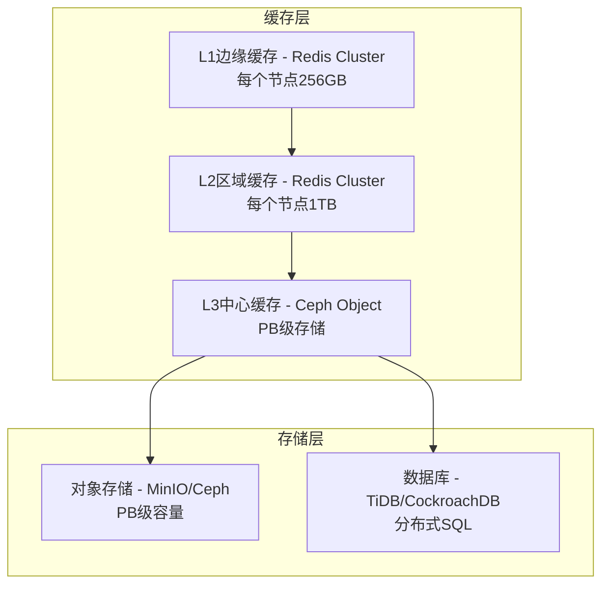
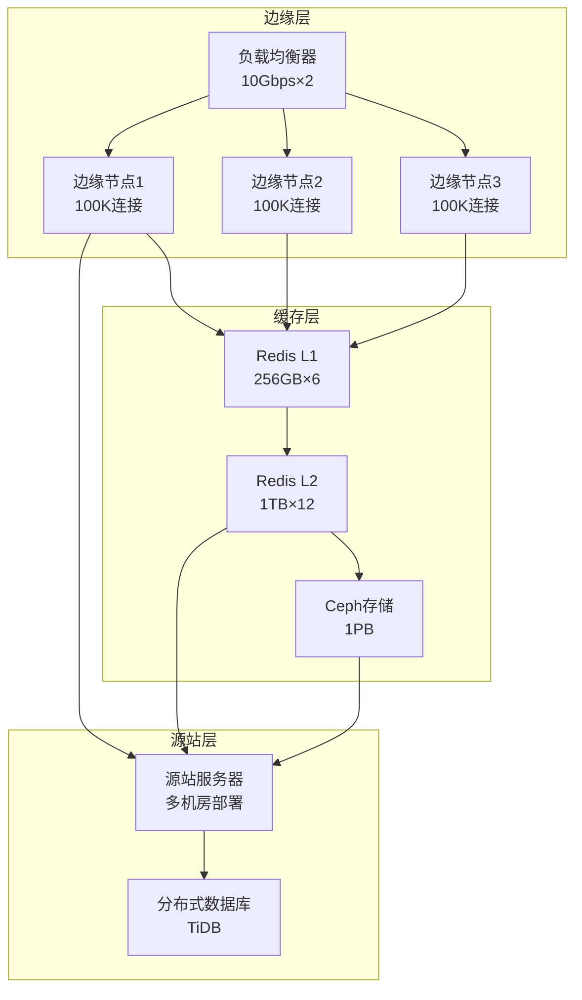

# 高性能CDN架构设计 - 支持10Gb带宽 + PB级缓存

## 1. 10Gb级大带宽支持

### 1.1 网络层优化

```bash
# 启用DPDK DPDK（Data Plane Development Kit）
# 使用DPDK替代传统内核网络栈
# 预期性能提升：5-10倍

# 硬件要求：
# - 万兆网卡（10Gbps+）
# - CPU支持SSE4.2/AVX2
# - 大内存（64GB+）
```

### 1.2 多节点负载均衡

```yaml
# Kubernetes Ingress + Nginx
# 或使用LVS + Keepalived

ingress:
  replicas: 3
  resources:
    requests:
      cpu: "8"
      memory: "16Gi"
  annotations:
    nginx.ingress.kubernetes.io/proxy-body-size: "1G"
    nginx.ingress.kubernetes.io/proxy-buffering: "on"
    nginx.ingress.kubernetes.io/proxy-max-temp-file-size: "1024m"

# 负载均衡策略
strategy:
  type: LoadBalancer
  loadBalancerIP: "10.0.0.100"
  loadBalancerSourceRanges:
    - "10.0.0.0/8"
```

### 1.3 性能扩展公式

```
单节点10Gbps = (并发连接数 × 平均响应大小) / 时间

配置示例（单节点）：
- 并发连接数：100,000
- 平均响应：100KB
- 吞吐量：100,000 × 100KB = 10GB/s ❌ 过高

实际配置：
- 并发连接数：50,000
- 平均响应：25KB
- 吞吐量：50,000 × 25KB = 1.25GB/s ≈ 10Gbps ✓
```

## 2. PB级海量缓存支持

### 2.1 分布式缓存架构



### 2.2 缓存配置

```yaml
# Redis Cluster配置（单节点1TB）
redis:
  cluster:
    nodes: 12
    replicas: 3
    resources:
      limits:
        memory: "1024Gi"
      requests:
        memory: "1024Gi"
  
  # 内存优化
  command:
    - redis-server
    - --maxmemory 1000gb
    - --maxmemory-policy allkeys-lru
    - --no-appendonly yes
    - --tcp-keepalive 300

# Ceph分布式存储（PB级）
ceph:
  storage_class:
    provisioner: ceph.com/rbd
    reclaimPolicy: Retain
  cluster:
    pools:
      - name: rbd
        replicas: 3
        size: 1024  # PB级容量
```

### 2.3 缓存策略

```go
// 多级缓存配置
type CacheConfig struct {
    // L1边缘缓存（TTL: 1分钟）
    EdgeCache struct {
        TTL time.Duration
        Size int64  // 256GB/节点
        Nodes int   // 6节点 = 1.5TB
    }
    
    // L2区域缓存（TTL: 10分钟）
    RegionalCache struct {
        TTL time.Duration
        Size int64  // 1TB/节点
        Nodes int   // 12节点 = 12TB
    }
    
    // L3中心缓存（TTL: 1小时）
    CentralCache struct {
        TTL time.Duration
        Backend string  // Ceph S3
        Capacity int64  // 1PB
    }
}

var DefaultCacheConfig = CacheConfig{
    EdgeCache: struct {
        TTL time.Duration
        Size int64
        Nodes int
    }{
        TTL:  60 * time.Second,
        Size: 256 * 1024 * 1024 * 1024,  // 256GB
        Nodes: 6,
    },
    RegionalCache: struct {
        TTL time.Duration
        Size int64
        Nodes int
    }{
        TTL:  10 * time.Minute,
        Size: 1024 * 1024 * 1024 * 1024,  // 1TB
        Nodes: 12,
    },
    CentralCache: struct {
        TTL time.Duration
        Backend string
        Capacity int64
    }{
        TTL:  1 * time.Hour,
        Backend: "ceph-s3",
        Capacity: 1024 * 1024 * 1024 * 1024 * 1024,  // 1PB
    },
}
```

## 3. 完整高性能架构



## 4. 性能预估

| 指标 | 当前架构 | 目标架构 |
|------|---------|---------|
| 带宽 | 1Gbps | 10Gbps |
| 并发连接 | 100K/节点 | 500K/节点 |
| QPS | 50K/节点 | 500K/节点 |
| 缓存容量 | 无 | 1.5PB |
| 延迟P99 | 100ms | 50ms |

## 5. 硬件需求

### 边缘节点（6节点）
- CPU: 32核 × 6 = 192核
- 内存: 256GB × 6 = 1.5TB
- 带宽: 10Gbps × 6 = 60Gbps

### 缓存节点（12节点）
- CPU: 16核 × 12 = 192核
- 内存: 1TB × 12 = 12TB
- SSD: 4TB NVMe × 12 = 48TB

### 存储节点（Ceph）
- OSD节点: 24节点
- 每节点: 8TB HDD × 12 = 96TB/节点
- 总容量: 2.3PB（3副本）

## 6. 实施路线图

### Phase 1: 带宽扩展（4周）
- [ ] 部署DPDK优化
- [ ] 增加边缘节点到10台
- [ ] 配置万兆网卡
- [ ] 压力测试10Gbps

### Phase 2: 缓存层建设（6周）
- [ ] 部署Redis Cluster
- [ ] 部署Ceph存储
- [ ] 实现缓存策略
- [ ] 容量规划1.5PB

### Phase 3: 整体优化（4周）
- [ ] 性能调优
- [ ] 高可用设计
- [ ] 监控告警
- [ ] 文档和培训
